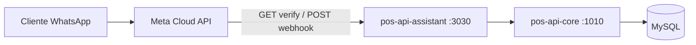

# Integración WhatsApp — Meta Cloud API (checklist)

Guía para pasar del **simulador** (`/platform/whatsapp`) a **WhatsApp real** con Meta.

## Arquitectura POS-AI hoy



| Capa | Estado actual |
|------|----------------|
| Webhook **verificación** (`GET /webhooks/whatsapp`) | Implementado |
| Webhook **entrada** (parse payload Meta `entry.changes`) | Implementado |
| Agente + stock + pedidos (core `/assistant/*`) | Implementado |
| Registro teléfono ↔ empresa (plataforma) | Implementado |
| Simulador web (`/platform/whatsapp`) | Implementado |
| **Envío de respuesta al cliente vía Graph API** | **Implementado** (`pos-api-assistant/src/meta/sendMessage.ts`) si hay `WHATSAPP_ACCESS_TOKEN` + `WHATSAPP_PHONE_NUMBER_ID` |

---

## 1. Requisitos en Meta (cuenta y app)

- [ ] [Meta Business](https://business.facebook.com/) verificada (o en revisión).
- [ ] App en [Meta for Developers](https://developers.facebook.com/) → producto **WhatsApp** agregado.
- [ ] **WhatsApp Business Account (WABA)** creada y vinculada.
- [ ] **Número de teléfono** agregado en WhatsApp Manager (sandbox de prueba o número producción).
- [ ] Token con permisos mínimos:
  - `whatsapp_business_messaging`
  - `whatsapp_business_management` (configuración)
- [ ] Anotar:
  - **Phone number ID** (no es el número visible; es el ID en la consola).
  - **WhatsApp Business Account ID** (opcional, para plantillas).
  - **Access token** (temporal 24h en dev; **System User** + token permanente en producción).

Documentación oficial: [WhatsApp Cloud API — Get Started](https://developers.facebook.com/docs/whatsapp/cloud-api/get-started).

---

## 2. Variables de entorno (checklist)

Copiar a `.env` / secretos del servidor. Referencia en `.env.docker.example`.

### Ya usadas en el repo

| Variable | Servicio | Obligatoria | Descripción |
|----------|----------|-------------|-------------|
| `WHATSAPP_VERIFY_TOKEN` | `pos-api-assistant` | Sí (prod) | Cadena secreta que **tú defines**; debe coincidir con la que configuras en Meta al crear el webhook. |
| `INTERNAL_API_KEY` | `pos-api-assistant`, core, BFF | Sí | Llave interna core ↔ assistant. |
| `CORE_API_BASE_URL` | `pos-api-assistant` | Sí | En Docker: `http://pos-api-core:1010`. |
| `ASSISTANT_API_BASE_URL` | `pos-api-bff` | Sí (simulador) | En Docker: `http://pos-api-assistant:3030`. |
| `OPENAI_API_KEY` | `pos-api-assistant` | No | IA conversacional; sin ella solo comandos (`sucursales`, `buscar`, `pedido`). |

### Envío real (Graph API)

| Variable | Servicio | Descripción |
|----------|----------|-------------|
| `WHATSAPP_ACCESS_TOKEN` | `pos-api-assistant` | Token Bearer de Meta (no commitear). |
| `WHATSAPP_PHONE_NUMBER_ID` | `pos-api-assistant` | ID del número desde WhatsApp → API Setup. |
| `WHATSAPP_API_VERSION` | `pos-api-assistant` | Ej. `v21.0` (default en código). |
| `META_APP_SECRET` | `pos-api-assistant` | Si está definido, valida `X-Hub-Signature-256` en cada POST. |

Ejemplo producción (assistant):

```env
WHATSAPP_VERIFY_TOKEN=<cadena-larga-aleatoria>
WHATSAPP_ACCESS_TOKEN=<token-meta>
WHATSAPP_PHONE_NUMBER_ID=123456789012345
WHATSAPP_API_VERSION=v21.0
META_APP_SECRET=<app-secret-desde-developers>
```

---

## 3. Webhook en Meta (consola)

En la app → **WhatsApp** → **Configuration** → **Webhook**:

| Campo | Valor |
|-------|--------|
| **Callback URL** | `https://<tu-dominio-publico>/webhooks/whatsapp` |
| **Verify token** | Mismo valor que `WHATSAPP_VERIFY_TOKEN` |

- [ ] URL accesible por internet (HTTPS). Meta **no** acepta `localhost`; usar túnel (`ngrok`, Cloudflare Tunnel) en dev.
- [ ] Puerto publicado: en Docker, exponer `3030` del servicio `pos-api-assistant` o poner un reverse proxy (nginx) que enrute `/webhooks/whatsapp` → assistant.
- [ ] Suscribir campo **`messages`** (y opcional `message_echoes` si depuras).
- [ ] Pulsar **Verify and save** — el servicio responde en `GET` con `hub.challenge` si el token coincide (ver `pos-api-assistant/src/webhooks/whatsapp.ts`).

### Verificación manual (dev)

```text
GET https://<host>/webhooks/whatsapp?hub.mode=subscribe&hub.verify_token=<WHATSAPP_VERIFY_TOKEN>&hub.challenge=12345
```

Respuesta esperada: cuerpo `12345` y HTTP 200.

---

## 4. Configuración en POS-AI (por tenant)

Por cada comercio con plan **Estándar** o **Full**:

1. [ ] En plataforma → **Empresas** → asignar plan Estándar/Full.
2. [ ] Sección **Canal WhatsApp** → registrar teléfono del cliente en formato E.164 **sin** `+` (ej. `56912345678`).
3. [ ] Ese número debe ser el mismo desde el que escribe el cliente a tu número de negocio en Meta (o el número de prueba del sandbox).

Tabla BD: `assistant_channel_bindings` (`external_id` = teléfono, `empresa_id` = tenant).

Demo: `56900000001` → Costa Azul (migración v1.7).

---

## 5. Flujo de mensaje (producción)

1. Cliente envía texto a tu número WABA.
2. Meta `POST` el JSON a `/webhooks/whatsapp`.
3. `pos-api-assistant` extrae `from` y `text`, resuelve empresa por binding, ejecuta agente.
4. **(Pendiente)** Llamar Graph API para enviar `reply` al cliente:

```http
POST https://graph.facebook.com/{WHATSAPP_API_VERSION}/{WHATSAPP_PHONE_NUMBER_ID}/messages
Authorization: Bearer {WHATSAPP_ACCESS_TOKEN}
Content-Type: application/json

{
  "messaging_product": "whatsapp",
  "to": "<telefono_sin_+>",
  "type": "text",
  "text": { "body": "<respuesta del agente>" }
}
```

5. Responder al webhook de Meta con **HTTP 200** rápido (aunque el envío sea asíncrono), para evitar reintentos.

---

## 6. Checklist de despliegue

### Infra

- [ ] `pos-api-core`, `pos-api-assistant`, MySQL en red interna.
- [ ] Solo `pos-api-assistant` (o proxy) expuesto a internet para el webhook.
- [ ] TLS válido en el dominio del webhook.
- [ ] Firewall: no exponer `:1010` core ni `:3308` MySQL.

### Seguridad

- [ ] `WHATSAPP_VERIFY_TOKEN` y `META_APP_SECRET` fuertes y en secret manager.
- [ ] Validar `X-Hub-Signature-256` en cada POST (recomendado).
- [ ] Rotar `WHATSAPP_ACCESS_TOKEN` con System User en producción.
- [ ] `INTERNAL_API_KEY` distinta a la de desarrollo.

### Funcional

- [ ] Migraciones v1.7 aplicadas (`.\scripts\migrate-v1.7-assistant.ps1`).
- [ ] Configurar `WHATSAPP_ACCESS_TOKEN` y `WHATSAPP_PHONE_NUMBER_ID` en el entorno del assistant.
- [ ] Probar: mensaje real → pedido PENDING en core → mensaje de pago al cliente.
- [ ] Límite de sesión: reiniciar assistant tras deploy (sesiones en memoria).

### Dev sin Meta

- [ ] Simulador: http://localhost:8010/platform/whatsapp
- [ ] O PowerShell contra `:3030` (ver `README.md`).

---

## 7. Sandbox Meta (primeras pruebas)

1. En API Setup, Meta da un **número de prueba** y hasta **5 números** de destinatarios autorizados.
2. Agrega tu móvil como destinatario de prueba.
3. Registra ese mismo número en POS-AI (binding) para el tenant de prueba.
4. Envía un mensaje al número de prueba de Meta desde tu móvil.
5. Deberías ver la respuesta del agente en WhatsApp (con token y phone number ID configurados).

---

## 8. Errores frecuentes

| Síntoma | Causa probable |
|---------|----------------|
| Verificación webhook falla | `WHATSAPP_VERIFY_TOKEN` distinto al de Meta o URL incorrecta. |
| Meta reintenta POST | Respuesta distinta de 200 o timeout > ~20s. |
| `Número no registrado` | Falta binding en plataforma o teléfono sin normalizar (solo dígitos). |
| `plan Estándar no disponible` | Tenant en plan Básico o `plan_id` incorrecto. |
| Cliente no recibe respuesta | Faltan `WHATSAPP_ACCESS_TOKEN` / `WHATSAPP_PHONE_NUMBER_ID` o error en Graph (ver logs assistant). |
| `fetch failed` en simulador | `pos-api-assistant` caído o BFF sin `ASSISTANT_API_BASE_URL`. |
| **`Not Found` / 404** en simulador | BFF o core sin rebuild tras cambios (`docker compose build pos-api-bff pos-api-core pos-api-assistant`). O binding inexistente → debería decir `ASSISTANT_BINDING_NOT_FOUND`. |

---

## 9. Código en el repo

| Archivo | Rol |
|---------|-----|
| `pos-api-assistant/src/meta/sendMessage.ts` | POST Graph API `messages` |
| `pos-api-assistant/src/meta/verifySignature.ts` | Firma `X-Hub-Signature-256` |
| `pos-api-assistant/src/webhooks/parseIncoming.ts` | Parse dev + Meta |
| `pos-api-assistant/src/webhooks/whatsapp.ts` | Webhook GET/POST |
| `GET /health` | Campos `metaSend`, `metaSignature` |

El **simulador** (`/platform/whatsapp`) sigue usando el formato dev (`from` + `text`) y devuelve `reply` en JSON sin llamar a Meta.
