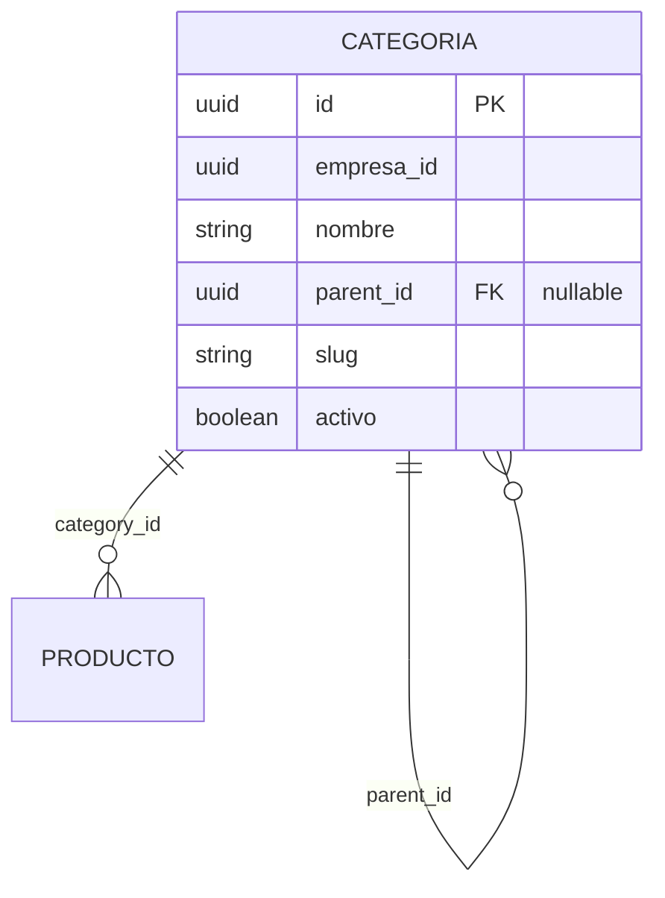

# Categorías jerárquicas — referencia técnica

Documento de apoyo al sprint [`SPRINT-CATALOGO-CATEGORIAS-2026-06.md`](../sprints/SPRINT-CATALOGO-CATEGORIAS-2026-06.md).

## Modelo



- **Categoría principal:** `parent_id IS NULL`
- **Subcategoría:** `parent_id` apunta a una principal (u otra sub, si en el futuro hay más niveles)

## Cache BFF (S1 B2)

- Módulo: `pos-api-bff/src/cache/categoryTreeCache.ts`
- TTL por defecto: 5 min (`CATEGORY_TREE_CACHE_TTL_MS` opcional)
- Se invalida al crear/editar/borrar/restaurar categoría

## Tests TDD

```powershell
cd pos-api-core
npm run test:catalog
```

## API (tenant vía BFF) — implementado v1.9


| Método | Ruta | Descripción |
|--------|------|-------------|
| GET | `/pos/proxy/catalog/categories/tree` | Árbol anidado para UI y assistant |
| GET | `/pos/proxy/catalog/categories` | Lista plana (compat) |
| POST | `/pos/proxy/catalog/categories` | Crear; body `{ name, parentId?, slug? }` |
| PATCH | `/pos/proxy/catalog/categories/:id` | Editar |
| DELETE | `/pos/proxy/catalog/categories/:id` | Soft-delete / desactivar |

## Slug

Generación sugerida: normalizar `nombre` → minúsculas, sin tildes, guiones (`Pizzas Premium` → `pizzas-premium`). Único por `empresa_id`.

## Validación producto

Al asignar `categoryId` a un producto:

1. Categoría existe y `activo = true`.
2. Misma `empresa_id` que el producto.
3. Preferencia: categoría sin hijos activos (nodo hoja).
