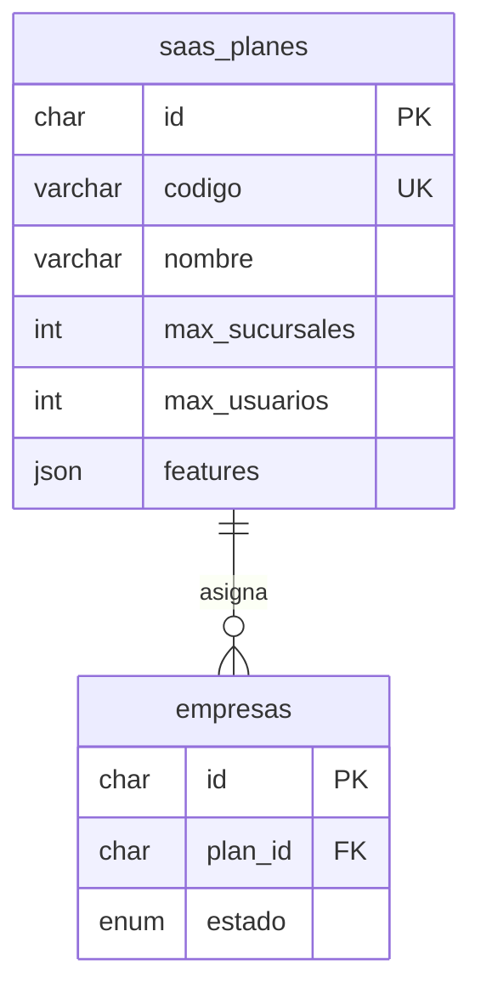

# Planes SaaS en base de datos

## Modelo

| Tabla | Rol |
|-------|-----|
| **`saas_planes`** | Catálogo global (Básico, Estándar, Full). No es por tenant. |
| **`empresas.plan_id`** | Plan vigente de cada empresa. Lo asigna plataforma al alta/cambio. |

### Campos del catálogo (`saas_planes`)

| Campo API | Columna BD | Uso |
|-----------|------------|-----|
| `valor` | `valor` | Precio mensual referencia CLP (sin IVA) |
| `descripcion` | `descripcion` | Texto comercial del plan |
| `metodoPago` | `metodo_pago` | `TRANSFERENCIA`, `WEBPAY`, `MERCADO_PAGO`, `FLOW`, `MIXTO` |
| `activo` | `is_active` | Si está disponible para asignar a empresas nuevas |

### Suscripción por tenant (`empresa_suscripciones`)

| Campo | Uso |
|-------|-----|
| `estado` | `PILOTO`, `ACTIVA`, `GRACIA`, `VENCIDA`, `CANCELADA` |
| `vence_en` | Fin del período vigente |
| `grace_hasta` | Acceso temporal tras vencimiento |
| `origen` | `PLATAFORMA`, `CHECKOUT`, `COMERCIAL` |

Login tenant valida empresa `ACTIVO` **y** suscripción vigente (`SUBSCRIPTION_EXPIRED` si venció).

Plataforma: `PATCH /empresas/platform/:empresaId/suscripcion` con `extendDays` o `graceDays`.

**Vencimiento automático (cron):** `POST /empresas/platform/jobs/refresh-subscriptions` (solo `x-internal-key`). Script: `.\scripts\cron-refresh-suscripciones.ps1` — programar 1×/día en el VPS.

Migración BD existente: `.\scripts\migrate-v1.6.1-suscripciones.ps1`

### Admin plataforma (`platform_users`)

Login en `POST /platform/auth/login` (core) con hash Argon2; seed al arrancar core desde `PLATFORM_ADMIN_*`.

## Códigos de plan

| Código | PYME | `max_sucursales` | `max_usuarios` | Roles incluidos | Features (JSON) |
|--------|------|------------------|----------------|-----------------|-----------------|
| `BASICO` | Un local | 1 | 3 | Admin, Vendedor, Comanda | 10 módulos ERP, sin IA |
| `ESTANDAR` | + WhatsApp | 3 | 6 | + Auditor, Comanda×sucursal | `assistantWhatsapp: true` |
| `FULL` | Omnicanal | 3 | 6 | Igual Estándar | WSP + voz + `pagosOnline: true` |

Precio referencia: valor en `saas_planes` + IVA 19% (checkout y landing).

Límites: el core valida al crear o restaurar sucursal/usuario activo (`PLAN_LIMIT_*`). Migración límites PYME: `v1.13.0/001-saas-planes-pyme-limits.sql`.

PYME informal (sin RUT): diseño en `PYME-INFORMAL-MODULO.md` — empieza Básico hasta formalizar.

## API (plataforma)

- `GET /empresas/planes/list` — catálogo (x-internal-key)
- `POST /empresas` — body opcional `planCodigo` o `planId` (default `BASICO`)
- `PATCH /empresas/:id/platform` — cambiar `planCodigo` / `planId`

Tenant (`GET /empresas/me`): devuelve plan en solo lectura.

## Migración

- Instalación nueva: `db-init/schema/v1.3-core.sql` + seed de planes.
- BD existente: `db-init/migrations/v1.6.0/001-saas-planes.sql`
