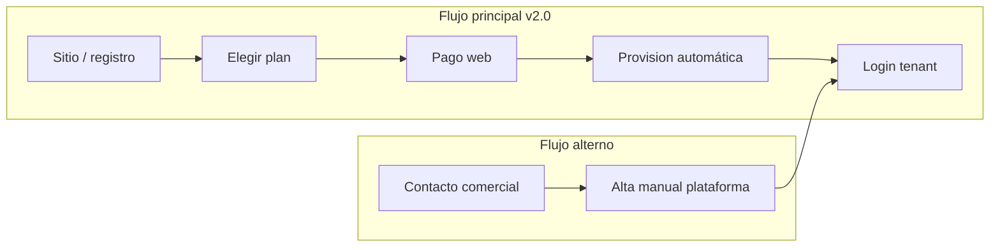

# Visión v2.0 — SaaS automatizado y cobro web

**Fecha:** 2026-05-31 · Complementa `PLAN-SAAS-POS-AI.md` y `PLANES-BD.md`.

---

## Idea central

En **v2.0** el producto debe funcionar como SaaS **self-service**: el cliente elige plan, paga en la web y entra a operar **sin que un admin de plataforma cree la empresa a mano**.

El canal **“nos contactan”** sigue existiendo (ventas, piloto, precio especial, factura manual), pero es la **excepción**, no el flujo principal.

---

## Dos canales de alta

| Canal | Quién | Cómo paga | Quién provisiona |
|-------|--------|-----------|------------------|
| **Web (default)** | PYME que se registra solo | Pasarela (Webpay / Mercado Pago / Flow) — mensual o anual | Sistema automático tras pago confirmado |
| **Directo con nosotros** | Cliente que escribe, llama o demo | Transferencia, factura, piloto negociado | Super-admin plataforma (como hoy) |

Regla de producto: **mismo motor** (planes en BD, suscripción, límites). Solo cambia **quién dispara** el alta: webhook de pago vs. formulario interno.

---

## Flujo web automatizado (objetivo v2.0)

1. **Landing / precios** — tres planes (Básico, Estándar, Full) con valor y descripción claros.
2. **Registro** — RUT empresa, razón social, email admin, contraseña (validación RUT Chile).
3. **Checkout** — plan seleccionado + IVA; opción mensual/anual.
4. **Pago** — redirect a pasarela; retorno con éxito o fallo.
5. **Webhook** — pasarela confirma → core crea en una transacción:
   - `empresas` + `plan_id`
   - `empresa_suscripciones` (activa, próximo cobro)
   - sucursal inicial + usuario ADMIN
   - estado `ACTIVO`
6. **Email** — bienvenida, link a `https://app.../login`, resumen de plan.
7. **Renovación** — cobro recurrente automático; si falla → gracia → `SUSPENDIDO` (sin borrar datos).

El usuario **no espera** a que “le habilitemos” la cuenta salvo el canal directo.

---

## Qué automatizar (checklist v2.0)

| Área | Automatizar | Notas |
|------|-------------|--------|
| Alta tenant | Sí | Hoy: plataforma manual. v2.0: post-pago |
| Asignación de plan | Sí | Ya hay `saas_planes` + `empresas.plan_id` (base v1.6) |
| Cobro recurrente | Sí | Suscripción en pasarela + webhooks |
| Factura/boleta al cliente | Ideal v2.0 o v2.1 | Integración DTE o proveedor billing |
| Límites sucursal/usuario | Sí | Bloquear creación si supera plan |
| Features por plan (IA, pagos) | Sí | Flags desde `features` JSON |
| Cambio de plan (upgrade) | Sí | Prorrateo vía pasarela |
| Baja / cancelación | Sí | Fin de período; no delete inmediato de BD |
| Soporte “habló con ventas” | Manual | Misma BD; flag `origen: COMERCIAL` |

---

## Pasarela y `metodo_pago` en catálogo

Hoy `metodo_pago` en `saas_planes` describe **cómo se cobra ese plan en el modelo comercial** (ej. transferencia en Básico, varios medios en Full).

En v2.0 conviene separar:

| Concepto | Dónde vive |
|----------|------------|
| Precio de lista (`valor`) | `saas_planes` |
| Cobro real del tenant | `empresa_suscripciones` + pasarela (customer_id, subscription_id) |
| Pago puntual en POS (venta al cliente final) | Módulo Full / integración distinta |

El **pago web del SaaS** (suscripción) no es lo mismo que **cobrar ventas en el local**; ambos pueden coexistir en plan Full.

---

## Roadmap sugerido (puente hacia v2.0)

| Versión | Enfoque | Relación con automatización |
|---------|---------|----------------------------|
| **v1.5** | Dashboard plataforma | Operar tenants manuales mientras no hay checkout |
| **v1.6** | Planes en BD + suscripción básica | Catálogo y vínculo empresa–plan (hecho / en curso) |
| **v1.7** | Asistente WSP (Estándar) | Feature flag por plan |
| **v1.8** | Integración pasarela (sandbox) | Webhooks, sin UI pública aún |
| **v1.9** | Registro público + checkout MVP | Primer flujo web sin ventas manual |
| **v2.0** | **SaaS cerrado** | Recurrencia, emails, bloqueo impago, upgrade; ventas directo como excepción |

No hace falta saltar a v2.0 de golpe: **v1.6–v1.9** son el cableado; **v2.0** es cuando el PYME entra solo por la web.

---

## Canal directo (cuándo usarlo)

- Piloto con descuento negociado.
- Cliente que no puede pagar con tarjeta / necesita factura especial.
- Multi-empresa o integración a medida.
- Soporte onboarding asistido (capacitación).

En plataforma: mantener **“Nueva empresa”** manual, con campos opcionales `origen`, `sin_cobro_automatico`, `notas_comercial`.

---

## Riesgos a diseñar antes de v2.0

- **Fraude / RUT duplicado** — validar RUT y email antes de activar.
- **Pago OK pero provision falla** — cola de reintentos + alerta a ops.
- **Webhook duplicado** — idempotencia por `payment_id`.
- **Churn** — período de gracia (ej. 3–7 días) antes de suspender login.

---

## Resumen en una frase

**v2.0 = el PYME paga en la web, el sistema le crea la empresa y el plan solo; nosotros solo intervenimos cuando el cliente viene por ventas directa.**

Próximo paso técnico natural tras cerrar v1.6: diseñar tabla `empresa_suscripciones` y contrato de webhooks con una pasarela (sandbox).
