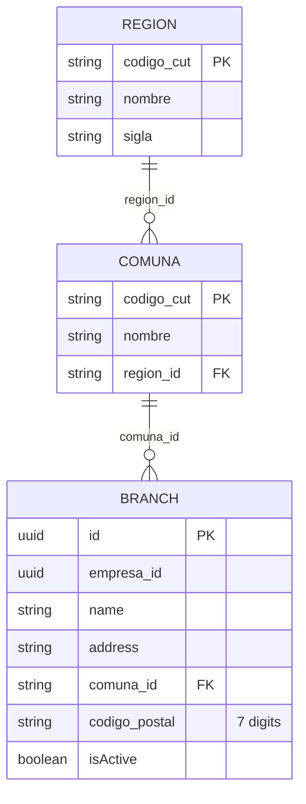

# CUT Chile — referencia técnica

Soporte al sprint [`SPRINT-TERRITORIO-CUT-SUCURSALES-2026-06.md`](../sprints/SPRINT-TERRITORIO-CUT-SUCURSALES-2026-06.md).

## Fuente oficial

- **CUT** — Código Único Territorial (SUBDERE / gobierno de Chile).
- CSV versionado: `data/cut/cut_comuna-subdere-2018.csv` (346 comunas).
- Generar TS: `node scripts/build-chile-cut-data.mjs` → `pos-api-core/src/db/cut/chileCutData.ts`
- Seed al arranque: `seedCutChile()` (upsert si hay menos de 346 comunas).

## Diagrama



## API prevista (BFF → tenant / assistant interno)

| Método | Ruta | Uso |
|--------|------|-----|
| GET | `/pos/proxy/territory/regions` | Dropdown región |
| GET | `/pos/proxy/territory/comunas?regionId=13` | Comunas de la RM |
| GET | `/pos/proxy/territory/comunas/search?q=` | Agente voz / autocompletar |
| POST | `/pos/proxy/territory/resolve` | Match comuna + sucursales por texto/CP |

## Código postal (CorreosChile)

- Formato: **7 dígitos** (ej. `1240000`).
- Almacenado en `branches.codigo_postal`.
- Validación servidor: `/^\d{7}$/`.

## Búsqueda STT-friendly

Entrada posible del agente: `"estacion central"`, `"rm estacion"`, `"13101"`.

Estrategia:

1. Si `q` es 5 dígitos → match directo `comuna.codigo_cut`.
2. Si no → normalizar Unicode NFD, quitar diacríticos, `LIKE %estacion central%` sobre `nombre` o columna `nombre_busqueda`.
3. Devolver máximo 5 candidatos numerados para desambiguación.

## Extensión sucursal (PATCH branches)

Body adicional:

```json
{
  "name": "Sucursal Antofagasta Centro",
  "address": "Arturo Prat 450",
  "comunaId": "2101",
  "codigoPostal": "1240000",
  "phone": "+569..."
}
```
